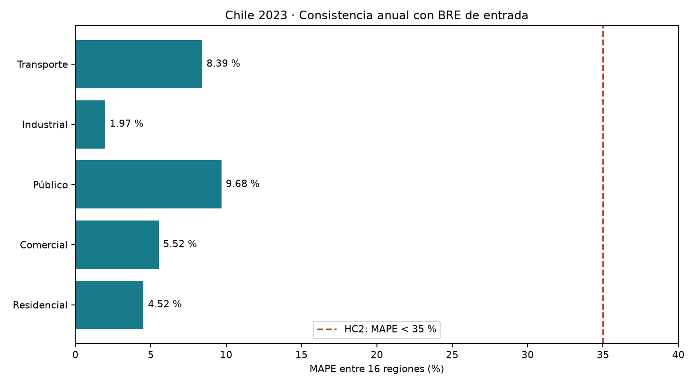
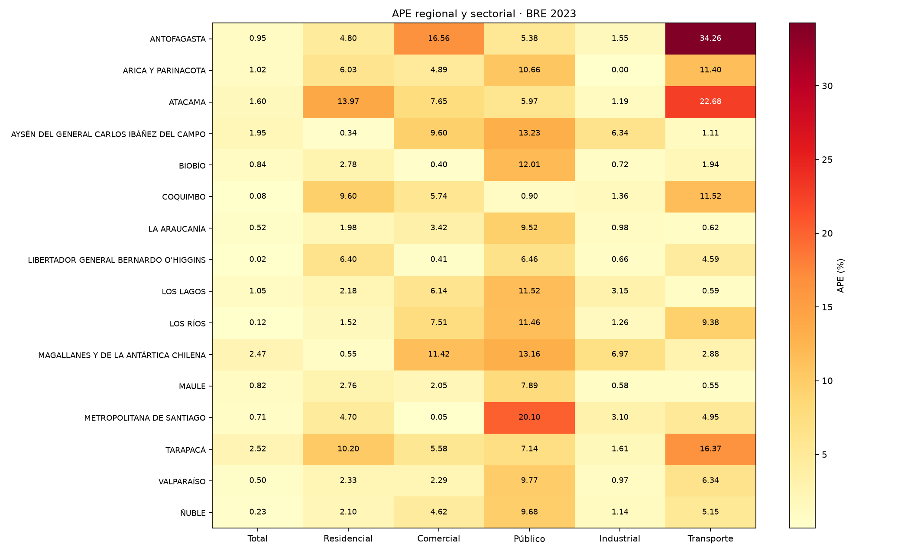

# Piloto regional 2023 — inferencia y comparación BRE

ID: `CORFO-MERLIN-EDM-CHILE-BRE2023`. Estado: inferencia ejecutada; consistencia anual reproducible, pendiente de aceptación como validación formal.

16 regiones, 8760 horas por región, 140,160 filas horarias, 96 APE y seis MAPE. No se reentrenaron los pesos. MAPE del total: **0.96284 %**.

| Categoría | MAPE (%) | Regiones | Umbral HC2 <35 % |
|---|---:|---:|---|
| Total | 0.96284 | 16 | No se cuenta como sector |
| Residencial | 4.51502 | 16 | Sí |
| Comercial | 5.52105 | 16 | Sí |
| Público | 9.67746 | 16 | Sí |
| Industrial | 1.97379 | 16 | Sí |
| Transporte | 8.39492 | 16 | Sí |

**5/5 sectores (100 %) bajo el umbral numérico.** Se usa el valor sin redondear y el total no cuenta como sexto sector. [Fuente HC2](https://github.com/FCR-CSET-Merlin/merlin-index/blob/a9b855f60c4ad207d7c2544a07e4f43d25356209/05-roadmap/01-antecedentes/Resultados_Excel_CORFO.md).

## Método y límites

Reconstrucción condicionada al BRE observado del mismo año: shares, mu y sigma utilizan el balance con el que se compara. APE = 100 × |predicción − BRE| / |BRE|; MAPE es la media sin ponderación de los 16 APE. La condición numérica local no acredita HC2 completo, validación independiente, demanda térmica ni Alemania.

Se reutilizan modelo global, scaler y orden de 24 entradas. Calendario CL con subdivisión regional sobre timestamps sin zona explícita; no se cambia la convención temporal. Los siete rezagos físicos se contrastan contra las horas previas reales, incluido diciembre del año anterior. A diferencia del inicio circular de np.roll del notebook 2024–2025, el piloto no conecta el final del año con enero.

Escalamiento: mu = energía BRE en MWh / 8760; sigma = exp(-1.1315) × mu^0.8988, también para escenarios sin sector. Se conserva la resta de escenarios y clipping de inference.py. No se impone cierre sectorial ni anual a posteriori. Fracción de entradas climáticas escaladas fuera de [0,1]: 0.000000%; no se recortan ni se reajusta el scaler.

Los metadatos globales inspeccionados corresponden a entrenamiento 2018–2019, validación 2020 y prueba 2021. No certifican la historia completa de los pesos. Esta ejecución registra sus hashes y el código actual; el commit del entrenamiento original sigue sin establecerse.

## Resultados por región

| Región | Total | Residencial | Comercial | Público | Industrial | Transporte |
|---|---:|---:|---:|---:|---:|---:|
| ANTOFAGASTA | 0.95 % | 4.80 % | 16.56 % | 5.38 % | 1.55 % | 34.26 % |
| ARICA Y PARINACOTA | 1.02 % | 6.03 % | 4.89 % | 10.66 % | 0.00 % | 11.40 % |
| ATACAMA | 1.60 % | 13.97 % | 7.65 % | 5.97 % | 1.19 % | 22.68 % |
| AYSÉN DEL GENERAL CARLOS IBÁÑEZ DEL CAMPO | 1.95 % | 0.34 % | 9.60 % | 13.23 % | 6.34 % | 1.11 % |
| BIOBÍO | 0.84 % | 2.78 % | 0.40 % | 12.01 % | 0.72 % | 1.94 % |
| COQUIMBO | 0.08 % | 9.60 % | 5.74 % | 0.90 % | 1.36 % | 11.52 % |
| LA ARAUCANÍA | 0.52 % | 1.98 % | 3.42 % | 9.52 % | 0.98 % | 0.62 % |
| LIBERTADOR GENERAL BERNARDO O'HIGGINS | 0.02 % | 6.40 % | 0.41 % | 6.46 % | 0.66 % | 4.59 % |
| LOS LAGOS | 1.05 % | 2.18 % | 6.14 % | 11.52 % | 3.15 % | 0.59 % |
| LOS RÍOS | 0.12 % | 1.52 % | 7.51 % | 11.46 % | 1.26 % | 9.38 % |
| MAGALLANES Y DE LA ANTÁRTICA CHILENA | 2.47 % | 0.55 % | 11.42 % | 13.16 % | 6.97 % | 2.88 % |
| MAULE | 0.82 % | 2.76 % | 2.05 % | 7.89 % | 0.58 % | 0.55 % |
| METROPOLITANA DE SANTIAGO | 0.71 % | 4.70 % | 0.05 % | 20.10 % | 3.10 % | 4.95 % |
| TARAPACÁ | 2.52 % | 10.20 % | 5.58 % | 7.14 % | 1.61 % | 16.37 % |
| VALPARAÍSO | 0.50 % | 2.33 % | 2.29 % | 9.77 % | 0.97 % | 6.34 % |
| ÑUBLE | 0.23 % | 2.10 % | 4.62 % | 9.68 % | 1.14 % | 5.15 % |





## Reproducción y archivos

Desde la raíz, en el entorno merlin_edm:

```bash
python prototipo_3/src/reconstruct_regional.py --year 2023
```

Para repetir un caso ya existente añadir `--overwrite`. Raíces configurables mediante `--artifact-root`, `--report-root` y `--timeseries-dir`. Se requiere acceso a los artefactos externos. Las versiones, hashes y verificaciones están en el manifiesto.

- [APE y valores de referencia](ape_region_sector.csv).
- [MAPE por categoría](mape_sectorial.csv).
- [KPI por sector](kpi_validation.csv).
- [Totales simulados en GWh](../../results/tables/demanda_regional_sectorial_2023.csv).
- [Figura de demanda simulada](../../results/figures/demanda_regional_2023.png).
- [Manifiesto de ejecución](manifiesto.json).
- Serie horaria pesada: `/srv/compartido/inbox/MERLIN_EDM/prototipo_3/data/rec_historica/2023/demanda_regional_2023_horaria.parquet` (fuera del control de Git).
